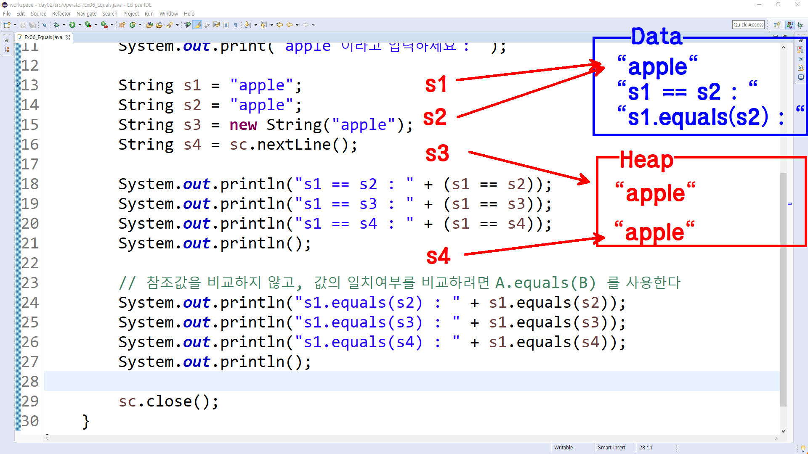

[Google](https://google.com){: .btn .btn--warning}


# JAVA 연산자

# 자료



```java

public static void main(String[] args) {
		
		// 참조의 대상이 같은 경우와 값이 같은 경우
		Scanner sc = new Scanner(System.in);
		System.out.print("apple 이라고 입력하세요 : ");
		
		String s1 = "apple";
		String s2 = "apple";
		String s3 = new String("apple");
		String s4 = sc.nextLine();
		
		System.out.println("s1 == s2 : " + (s1 == s2));
		System.out.println("s1 == s3 : " + (s1 == s3));
		System.out.println("s1 == s4 : " + (s1 == s4));
		System.out.println();
		
		// 참조값을 비교하지 않고, 값의 일치여부를 비교하려면 A.equals(B) 를 사용한다
		System.out.println("s1.equals(s2) : " + s1.equals(s2));
		System.out.println("s1.equals(s3) : " + s1.equals(s3));
		System.out.println("s1.equals(s4) : " + s1.equals(s4));
		System.out.println();
		
		sc.close();
}
